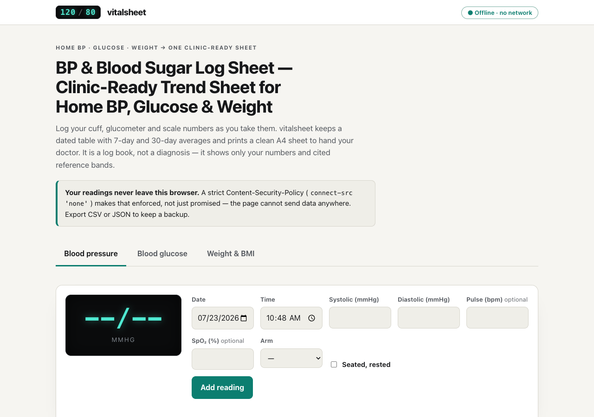

# vitalsheet

**BP & Blood Sugar Log Sheet — a clinic-ready trend sheet for home readings.** Log your home
blood-pressure, glucose and weight numbers as you take them; vitalsheet keeps a dated table with
7-day and 30-day averages and prints a clean A4 sheet to hand your doctor. 100% client-side, zero
dependencies, works fully offline — nothing ever leaves your device.



## Why

If you have hypertension or diabetes you have probably been told: *"bring your readings to your next
appointment."* Most people arrive with a crumpled slip of paper or a phone full of scattered
numbers. vitalsheet turns those scattered home-cuff and glucometer readings into **one dated,
clinic-ready trend sheet** — with plain averages and cited reference bands — that prints to A4 or
exports as CSV.

It is a **log book, not a diagnosis.** It shows only your numbers and published reference-band
wording, quoted verbatim. It never says "improving", "worsening", or "is this bad?" — that
conversation belongs with your clinician.

## Features

- **Three device modes** — Blood pressure (systolic/diastolic mmHg, optional pulse & SpO₂, arm and
  seated tags), Blood glucose (mg/dL with a fasting / after-meal / random context and an mmol/L
  display toggle), and Weight (kg, with a one-time height entry for BMI).
- **Fast entry** — date and time prefilled to now, large numeric fields, saves in two taps; every
  row is editable and deletable.
- **Plain averages** — 7-day and 30-day arithmetic means of exactly the readings you logged,
  labelled *average of logged readings* — never "your true BP".
- **Cited reference bands, verbatim** — each reading can be chip-tagged with the exact published
  wording: 2017 ACC/AHA blood-pressure categories, the ADA glucose target, and WHO BMI classes.
  One toggle hides all band tags. Out-of-cited-range is shown with a **▲ glyph and text**, never by
  colour alone.
- **Clinic-ready A4 print** — optional name/DOB (kept only on your device), a dated table, the
  averages block, a blank clinician-notes column, and a sources + verified-on footer. The browser's
  print-to-PDF *is* the PDF — no PDF library.
- **CSV export** — per-mode and combined, RFC-4180 (CRLF line endings, quoted fields).
- **Your data, your device** — full JSON backup export/import and an erase-all control.

## Quickstart

Just open `index.html` in any modern browser — no build step, no server, no install.

- **Local:** double-click `index.html`, or run a static server in the folder.
- **Hosted:** **[Open vitalsheet live](https://sreenivas-sadhu-prabhakara.github.io/vitalsheet/)**

Your readings are saved in this browser's local storage and persist between visits. Export a backup
regularly — clearing site data erases the log.

### Running the self-tests

```sh
node --test
```

The suite re-derives every formula (BP category, windowed averages, mg/dL↔mmol/L, BMI and WHO
class) against the hand-computed fixtures, asserts corpus invariants (25 facts, unique ids,
gap-free half-open BMI bands, closed label set) and runs a seeded property test.

## Privacy

vitalsheet is built to be trustworthy with health data.

- A strict Content-Security-Policy sets `connect-src 'none'`: the page **cannot** make any network
  request even if it tried. Your readings are never uploaded.
- No external fonts, scripts, images or analytics. Everything is self-contained and same-origin.
- All logic runs in your browser; readings live only in this device's local storage.
- Because there are no network dependencies, it works with **no signal at all**.

## Corpus & sources

All reference bands come from published guidelines, quoted verbatim with a `verified_on` date, in
`data/bands.js`; see [`sources/CITATIONS.md`](./sources/CITATIONS.md). Sources: AHA "Understanding
Blood Pressure Readings" and "Monitoring Your Blood Pressure at Home"; the 2017 ACC/AHA guideline
(Whelton et al.); the ADA Standards of Care "Glycemic Goals and Hypoglycemia"; and the WHO obesity
fact sheet / BMI classification. Verified 2026-07-23. Where a primary page blocked automated
retrieval (HTTP 403), the value was cross-checked against a secondary authority and labelled
accordingly — never fabricated.

## Honest limits

- **Not a medical device and gives no advice.** It renders cited band wording verbatim with
  verified-on dates and never answers "is this bad?".
- **Bands are dated population guidelines.** The ADA itself states glycemic targets are
  individualized; band tags carry that caveat and can be hidden entirely with one toggle.
- **Readings exist only in this browser.** Clearing site data erases them; regular CSV/JSON export
  is the only backup.
- **No reminders.** A static page cannot nudge; the twice-daily logging discipline stays with you.
- **Manual entry means typos are possible.** Every row is editable and averages are plain
  arithmetic means of exactly what was typed.
- This build ships a single local profile; multi-profile support was intentionally deferred.

## Disclaimer

vitalsheet provides general informational logging and cited reference bands for educational
purposes only. **It is not a medical device, not medical advice, and not a substitute for
professional care.** It does not diagnose, interpret, or judge your readings, and it never answers
"is this bad?". Reference bands are dated population guidelines and may not apply to you; always
consult a qualified clinician about your readings and targets. This software is provided under the
MIT License, "as is", without warranty of any kind; the author accepts no liability for any loss,
injury, or damage arising from its use.

## License

[MIT](./LICENSE) © 2026 Sreenivas Sadhu Prabhakara
